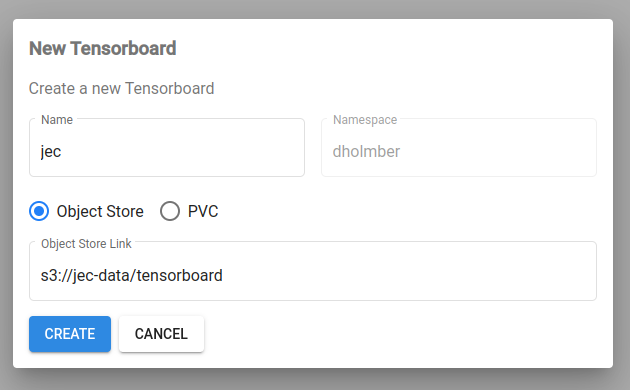
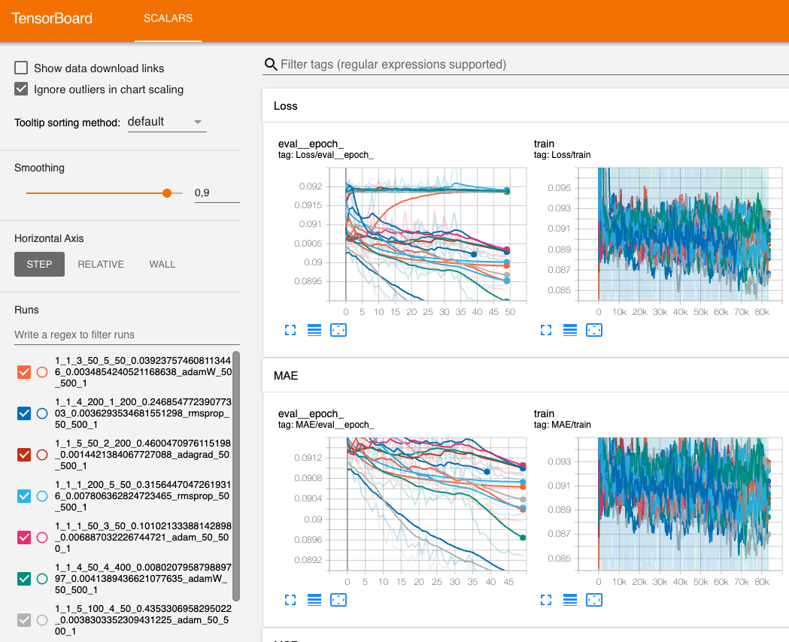

# JEC Pipeline

## Setup

Kubeflow is locked behind CERN single sign on. A [CLI tool](https://gitlab.cern.ch/authzsvc/tools/auth-get-sso-cookie), preinstalled on [lxplus8](https://lxplusdoc.web.cern.ch), generates cookies needed to bypass the SSO.
```
auth-get-sso-cookie -u https://ml.cern.ch -o cookies.txt
```

```
auth-get-sso-cookie -u https://ml-staging.cern.ch -o cookies.txt
```

Changes are put into containers stored on CERN's [own registry](https://registry.cern.ch/harbor/projects/34/repositories). Use the credentials from the user profile on harbor to log in to the registry.
```
docker login registry.cern.ch
```

```
docker build training -t registry.cern.ch/ml/jec-training
docker push registry.cern.ch/ml/jec-training
```

```
docker build exporting -t registry.cern.ch/ml/jec-exporting
docker push registry.cern.ch/ml/jec-exporting
```

```
docker build serving -t registry.cern.ch/ml/jec-serving
docker push registry.cern.ch/ml/jec-serving
```

```
docker build weaver -t registry.cern.ch/ml/weaver
docker push registry.cern.ch/ml/weaver
```

## Data

EOS: `/eos/cms/store/group/phys_jetmet/dholmber/jec-data`

Create kerberos secret on Kubeflow

```
kinit <cernid>
kubectl delete secret krb-secret
kubectl create secret generic krb-secret --from-file=/tmp/krb5cc_1000
```

Create s3 secret on Kubeflow
  - Put aws secrets into `secret.yaml` (e.g. from `openstack ec2 credentials list`) 
  - `kubectl apply -f secret.yaml`

## Tensorboard

Navigate to https://ml-staging.cern.ch/_/tensorboards/ and create a Tensorboard for your log directory.



Now the runs are accessible to the deployed Tensorboard



Note: until [awslabs/kubeflow-manifests/issues/118](https://github.com/awslabs/kubeflow-manifests/issues/118) is resolved AWS environment variables have to be entered manually:

```
kubectl edit deployment <tensorboard_name>

        env:
        - name: S3_ENDPOINT
          value: s3.cern.ch
        - name: AWS_ACCESS_KEY_ID
          valueFrom:
            secretKeyRef:
              key: AWS_ACCESS_KEY_ID
              name: s3-secret
        - name: AWS_SECRET_ACCESS_KEY
          valueFrom:
            secretKeyRef:
              key: AWS_SECRET_ACCESS_KEY
              name: s3-secret
```

should be fixed in https://its.cern.ch/jira/browse/OS-15903


## Run Pipeline

Install [kfp](https://www.kubeflow.org/docs/components/pipelines/sdk/install-sdk), e.g. on lxplus8: `pip3 install kfp`

```
python3 pipeline.py
```

```
optional arguments:
  -h, --help            show this help message and exit
  --namespace NAMESPACE
                        Kubeflow namespace to run pipeline in
  --experiment-name EXPERIMENT_NAME
                        name for KFP experiment on Kubeflow
  --num-replicas NUM_REPLICAS
                        number of nodes to train on
  --num-gpus NUM_GPUS   
                        number of gpus per node, maximum in the cluster is 1
  --num-cpus NUM_CPUS   
                        number of cpus to use (for data loader)
  --data-config DATA_CONFIG
                        data configuration yaml file
  --network-config NETWORK_CONFIG
                        network architecture configuration file
  --s3-bucket S3_BUCKET
                        s3 bucket used by the pipeline for storing models and tensorboard log dirs
  --data-train DATA_TRAIN
                        training data
  --data-val DATA_VAL   
                        validation data
  --data-test DATA_TEST
                        test data
  --delete-train-experiment
                        whether or not to delete the hp tuning experiment once finished
  --delete-export-job
                        whether or not to delete the export job once finished
```

# Katib experiment

python3 pipeline.py \
  --data-config=data/jec_pfn_open.yaml \
  --network-config=networks/pfn_regressor_open.py \
  --data-train=s3://jec-data/open/katib/train/*.root \
  --data-val=s3://jec-data/open/katib/val/*.root \
  --data-test=s3://jec-data/open/katib/test/*.root \
  --memory=8Gi --num-gpus=1 --num-cpus=1 --num-replicas=1 \
  --experiment-name=jec-production

python3 pipeline.py \
  --data-config=data/jec_particle_net_open.yaml \
  --network-config=networks/particle_net_regressor_open.py \
  --data-train=s3://jec-data/open/katib/train/*.root \
  --data-val=s3://jec-data/open/katib/val/*.root \
  --data-test=s3://jec-data/open/katib/test/*.root \
  --memory=8Gi --num-gpus=1 --num-cpus=1 --num-replicas=1 \
  --experiment-name=jec-production

## Distributed training

PytorchJob injects MASTER_HOST, MASTER_PORT, WORLD_SIZE, RANK
