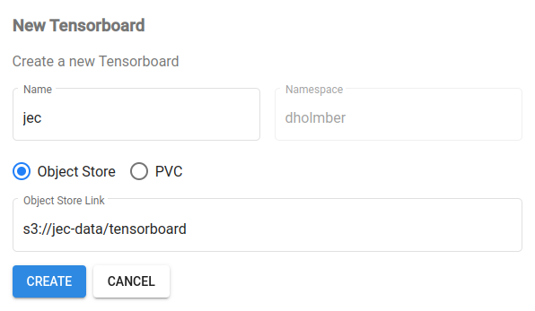

# JEC Pipeline

Jet Energy Calibration with Deep Learning as a Kubeflow Pipeline

## Description

The pipeline consists of three steps: 1. perform HP tuning with Katib, 2. export the optimal PyTorch model to ONNX, and 3. serve the model with KServe.

### AutoML experiment

The first step is an AutoML experiment that can be monitored on https://ml.cern.ch/_/katib. It consists of a hierarchy of Kubernetes custom resources with Experiment being the highest, submitting multiple parallel random search Trials, which in turn creates PyTorchJobs that spawns the amount of workers specified in the `training.yaml` file. A [customized version of the deep learning framework Weaver](https://github.com/deinal/weaver/tree/dev/jet-energy-corrections) is used for the training itself, changes include S3 communication and the creation of ONNX configuration files.  To learn more about PyTorchJobs there are examples available in the official Kubeflow [training-operator repository](https://github.com/kubeflow/training-operator/tree/master/examples/pytorch), or in the IT department's own [repository](https://gitlab.cern.ch/ai-ml/examples).


### Model exportation

The export step runs as a PyTorchJob specified in `exporting/template.yaml`. It gets the path to the optimal model from the previous step, in addition to data/network configurations plus the output ONNX path and config file for serving. A full description of model is available [here](https://docs.nvidia.com/deeplearning/triton-inference-server/user-guide/docs/user_guide/model_configuration.html), and [here](https://github.com/triton-inference-server/onnxruntime_backend).

```
s3://jec-data/<run-id>/
  optimal/
    config.pbtxt
    1/
      model.onnx
```

### Serving

Models are served with KServe using NVIDIA Triton as the predictor, or backend. The InferenceService is defined in `serving/template.yaml`. Model files and configs are read from S3 storage and placed in a predictor pod. Deployed models appear on Kubeflow at https://ml.cern.ch/_/models/. Docs on serving with KServe utilizing Triton [is available for TorchScript](https://kserve.github.io/website/0.10/modelserving/v1beta1/triton/torchscript/), but not ONNX Runtime as of yet. However, it is a very similar setup. The comlete analysis of model througput and the models performance on energy calibration is hosted here: https://gitlab.cern.ch/dholmber/jec-inference.


## Setup

The workspace was set up on a virtual machine (VM) hosted on CERN OpenStack Infrastructure. Instructions for creating a VM can be found [here](https://clouddocs.web.cern.ch/), and a step-by-step writeup is available [here](https://gitlab.cern.ch/dholmber/vm-setup) as well. 

Kubeflow is locked behind CERN single sign on. A [CLI tool](https://gitlab.cern.ch/authzsvc/tools/auth-get-sso-cookie) generates cookies needed to bypass the SSO when submitting pipeline runs.
```
auth-get-sso-cookie -u https://ml.cern.ch -o cookies.txt
```

## Container registry

Pipeline steps fetch containers from a container registry. We utilize CERN's [own Harbor registry](https://registry.cern.ch/).

Use the credentials from the user profile on Harbor to log in to the registry.
```
docker login registry.cern.ch
```

Once you have a project set up on some container registry, you can push changes in the pipeline there.

```
docker build training -t registry.cern.ch/ml/jec-training
docker push registry.cern.ch/ml/jec-training
```

```
docker build exporting -t registry.cern.ch/ml/jec-exporting
docker push registry.cern.ch/ml/jec-exporting
```

```
docker build serving -t registry.cern.ch/ml/jec-serving
docker push registry.cern.ch/ml/jec-serving
```

```
docker build weaver -t registry.cern.ch/ml/weaver
docker push registry.cern.ch/ml/weaver
```

## Cluster commands

Kubernetes resources are managed with `kubectl`. By setting up a notebook server on https://ml.cern.ch/_/jupyter/ (choose you own namespace) you have access to Kubeflow cluster resources through the built-in terminal.

Example commands that might be useful:
```
kubectl get pods
kubectl describe pod <pod-name>
kubectl logs pod <trial-pod-name> pytorch
kubectl create -f <yaml-spec-file>
kubectl delete -f <yaml-spec-file>
kubectl get resourcequota
kubectl get pytorchjobs
kubectl get inferenceservice
...
```

## Data storage

### EOS

A previous JEC dataset was stored on EOS `/eos/cms/store/group/phys_jetmet/dholmber/jec-data`. However, due to no autoamtic Kerberos credential renewal as of yet, the HP tuning jobs can be max 24 hours long. However, for training runs shorter than that EOS is perfectly fine as a storage option for training data already.

Here is how to create a Kerberos secret on Kubeflow (which is mounted in `training/template.yaml`):

```
kinit <cernid>
kubectl delete secret krb-secret
kubectl create secret generic krb-secret --from-file=/tmp/krb5cc_1000
```

### S3

Request a bucket on CERN Object Store, instructions [here](https://clouddocs.web.cern.ch/object_store/index.html).

Create S3 secret on Kubeflow
  - Put aws secrets into `secret.yaml` (e.g. from `openstack ec2 credentials list`)
  - `kubectl apply -f secret.yaml`

## OpenData

QCD sample downloaded from http://opendata.cern.ch/record/12100. In total, 1.42M jets are used: 60% training, 20% validation, and 20% test splits. The following ROOT files were used:

```
$ s3cmd ls s3://jec-data/open/katib/train/
s3://jec-data/open/katib/train/JetNtuple_RunIISummer16_13TeV_MC_10.root
s3://jec-data/open/katib/train/JetNtuple_RunIISummer16_13TeV_MC_19.root
s3://jec-data/open/katib/train/JetNtuple_RunIISummer16_13TeV_MC_27.root
s3://jec-data/open/katib/train/JetNtuple_RunIISummer16_13TeV_MC_35.root
s3://jec-data/open/katib/train/JetNtuple_RunIISummer16_13TeV_MC_66.root
s3://jec-data/open/katib/train/JetNtuple_RunIISummer16_13TeV_MC_7.root

$ s3cmd ls s3://jec-data/open/katib/val/
s3://jec-data/open/katib/val/JetNtuple_RunIISummer16_13TeV_MC_11.root
s3://jec-data/open/katib/val/JetNtuple_RunIISummer16_13TeV_MC_90.root

$ s3cmd ls s3://jec-data/open/katib/test/
s3://jec-data/open/katib/test/JetNtuple_RunIISummer16_13TeV_MC_103.root
s3://jec-data/open/katib/test/JetNtuple_RunIISummer16_13TeV_MC_96.root
```

## Run Pipeline

Install [kfp](https://www.kubeflow.org/docs/components/pipelines/sdk/install-sdk) e.g.: `pip3 install kfp`

To run a default pipeline:
```
python3 pipeline.py
```

Optional arguments:
```
  -h, --help            show this help message and exit
  --namespace NAMESPACE
                        Kubeflow namespace to run pipeline in
  --experiment-name EXPERIMENT_NAME
                        name for KFP experiment on Kubeflow
  --num-replicas NUM_REPLICAS
                        number of nodes to train on
  --num-gpus NUM_GPUS   
                        number of gpus per node, maximum in the cluster is 1
  --num-cpus NUM_CPUS   
                        number of cpus to use (for data loader)
  --data-config DATA_CONFIG
                        data configuration yaml file
  --network-config NETWORK_CONFIG
                        network architecture configuration file
  --s3-bucket S3_BUCKET
                        s3 bucket used by the pipeline for storing models and tensorboard log dirs
  --data-train DATA_TRAIN
                        training data
  --data-val DATA_VAL   
                        validation data
  --data-test DATA_TEST
                        test data
  --delete-train-experiment
                        whether or not to delete the hp tuning experiment once finished
  --delete-export-job
                        whether or not to delete the export job once finished
```

PFN pipeline can be run with:
```
python3 pipeline.py \
  --data-config=data/jec_pfn_open.yaml \
  --network-config=networks/pfn_regressor_open.py \
  --data-train=s3://jec-data/open/katib/train/*.root \
  --data-val=s3://jec-data/open/katib/val/*.root \
  --data-test=s3://jec-data/open/katib/test/*.root \
  --memory=12Gi --num-gpus=1 --num-cpus=1 --num-replicas=1 \
  --experiment-name=jec-production
```

ParticleNet can be run with:
```
python3 pipeline.py \
  --data-config=data/jec_particle_net_open.yaml \
  --network-config=networks/particle_net_regressor_open.py \
  --data-train=s3://jec-data/open/katib/train/*.root \
  --data-val=s3://jec-data/open/katib/val/*.root \
  --data-test=s3://jec-data/open/katib/test/*.root \
  --memory=12Gi --num-gpus=1 --num-cpus=1 --num-replicas=1 \
  --experiment-name=jec-production
```

Note that the search space is defined in `training/template.yaml`. The current settings have `num-edge-conv-blocks`, and `k` set to one, since it was used to run PFN where those variables aren't applicable. For different search spaces this file must be updated and the changes should be pushed to a registry as described in [Container registry](#container-registry).

## Monitor progress via Tensorboard

Navigate to https://ml.cern.ch/_/tensorboards/ and create a Tensorboard for your log directory.



Note: until [awslabs/kubeflow-manifests/issues/118](https://github.com/awslabs/kubeflow-manifests/issues/118) is resolved AWS environment variables have to be entered manually. A fix was attempted in https://its.cern.ch/jira/browse/OS-15903, unsure if it is live in prod yet. Anyway, if the Tensorboard doesn't access S3 properly, copy-paste everything inside env in the following snippet when editing the tensorboard deployment and you should be fine.

```
$ kubectl edit deployment <tensorboard_name>

      containers:
      - args:
        - --logdir=s3://jec-data/tensorboard
        - --bind_all
        command:
        - /usr/local/bin/tensorboard
        env:
        - name: S3_ENDPOINT
          value: s3.cern.ch
        - name: AWS_ACCESS_KEY_ID
          valueFrom:
            secretKeyRef:
              key: AWS_ACCESS_KEY_ID
              name: s3-secret
        - name: AWS_SECRET_ACCESS_KEY
          valueFrom:
            secretKeyRef:
              key: AWS_SECRET_ACCESS_KEY
              name: s3-secret
        image: tensorflow/tensorflow:2.1.0
```

Now the runs are accessible to the deployed Tensorboard.


## Useful references

- https://ml.docs.cern.ch/
- https://clouddocs.web.cern.ch/
- https://www.kubeflow.org/docs/
